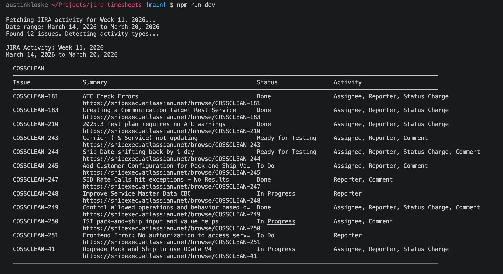

# JIRA Activity

Query your JIRA activity for a given week. Outputs a formatted table with activity types and clickable links, designed for easy copy-paste into external systems.

## Setup

```bash
npm install
cp .env.example .env
```

Edit `.env` with your JIRA credentials:

```bash
JIRA_EMAIL=your.email@company.com
JIRA_API_TOKEN=your_api_token_here
JIRA_DOMAIN=yourcompany.atlassian.net
```

**Getting a JIRA API Token:**
1. Go to https://id.atlassian.com/manage-profile/security/api-tokens
2. Click "Create API token"
3. Copy the token into your `.env`

## Usage

```bash
# List activity for previous week (default)
npm run dev

# Specific ISO week
npm run dev -- --week 2026-W13

# Custom date range
npm run dev -- --start 2026-03-16 --end 2026-03-20

# Save to file
npm run dev -- --save

# Test JIRA connection
npm run dev -- test-connection
```

## What It Queries

Issues where you are:
- **Assignee** - assigned to you
- **Reporter** - you created
- **Worklog author** - you logged time
- **Watcher** - you're watching (includes issues you commented on)

All issues updated within the specified date range are included.

## Activity Types

For each issue, the tool detects your specific involvement by checking changelogs, worklogs, and comments:

| Activity | Meaning |
|---|---|
| Assignee | You are the current assignee |
| Reporter | You created the issue |
| Worklog | You logged time during the period |
| Status Change | You transitioned the issue status |
| Comment | You commented during the period |
| Watcher | You're watching but had no other direct activity |

An issue can have multiple activity types.

## Output

Issues are grouped by JIRA project in a formatted table with URLs on their own line for easy copying:



## License

MIT
